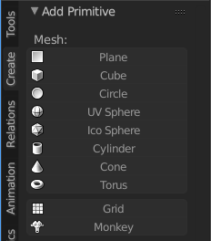
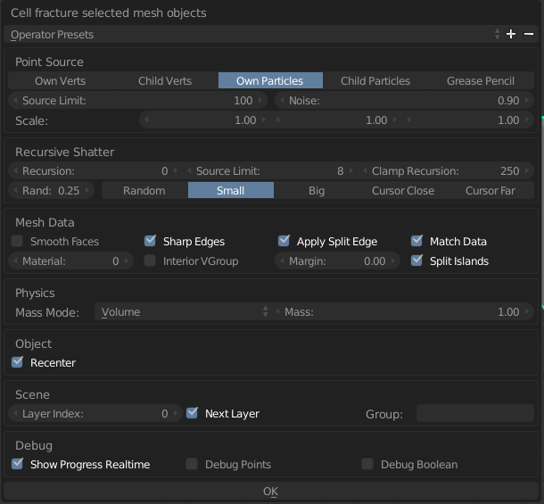

# Destructible-Environments
Testing destructible environments created in Blender through Unity.

### Notes
<editor-fold>
  1. Pressing buttons:

      ```A > A means press A then press A again```

      ```S > Z means press S then press Z```

      ```Ctrl + Alt + U means press Ctrl and Alt and U at the same time.```
</editor-fold>

### Creating the Destructible Blend Object in Blender
<editor-fold>
  1. Open blender, delete the default objects that are created by pressing ```A > A > DEL > ENTER```
    


  2. Go to ```File > User Preferences``` or ```Ctrl + Alt + U```

  3. Go to ```Add-ons > type fracture into search bar > select Object: Cell Fracture and Object: Fracture Tools```

  4. Save User Settings.
    

  5. Go to ```Create > Add Cube``` This adds a basic cube to the scene.

    

  6. Press ```S > Z > 2``` This will scale the cube to be 2 units high.

  7. Hold ```CTRL``` and move the cube by the blue arrow up until the bottom of the cube rests on the grid surface.
    

  8. Go to ```Tools > Cell Fracture```

    

  9. Change the Noise to ```0.85`` or above. This value is arbitrary. Choose a value that looks good to you. Then press OK.
    

  10. Notice that the fractured cube has been created on a different layer. Move to the other layer by clicking on it.
    

  11. Make sure that the fractures are where you like them. If it's not then just redo steps 8 and 9.

  12. Prepare the Blender object to be saved and used in Unity. Press ```A > R > X > -90 > CTRL + A > Apply rotation and scale``` Do this on both the fractured and unfractured cube.

  13. Now it's time to save. Press ```A > A``` to select all the fractured objects. Then press ```DEL > ENTER```

  14. Switch back to the first layer. Then press ```File > Save``` Then save wherever you would like.

  15. Press ```CTRL + Z > CTRL + Z``` in order to get your fractured cube back.

  16. Now go back to the first layer and delete that cube by doing ```A > DEL > ENTER```

  17. Move the fractured cube by switching to that layer, making sure that the entire cube is selected, then pressing ```M```, and finally selecting the first layer.

  18. Then press ```File > Save``` Again save wherever you would like.

  19. If you would like to make any further changes to the objects contained in the blend files you've created, make sure to press ```A > R > X > 90 > CTRL + A > Apply rotation and scale``` then when you want to save and export again, make sure to press ```A > R > X > -90 > CTRL + A > Apply rotation and scale.```
</editor-fold>

### Exporting the destructible blend object from Blender to Unity
<editor-fold>
  1. With Blender open to the file you created in the first section "Creating The Destructible Blend Object in Blender", press ```File > Export > FBX```
    


  2. Move the FBX files from the unfractured and fractured cube to your Unity project.  
</editor-fold>

### Creating the prefab in Unity
<editor-fold>
  1. Create a Parent Empty GameObject.

  2. Give this Parent Empty GameObject an Animator.
    

  3. Make the blend object the first child of the Parent Empty GameObject.

  4. Give this first child the Destructible script and a box collider.
    

  5. For each child object on the first child, add a rigidbody and a mesh collider.

  6. Make sure the Convex bool is set to true on each mesh collider.
    

</editor-fold>

### Creating a material that changes color over time
<editor-fold>

<editor-fold>
